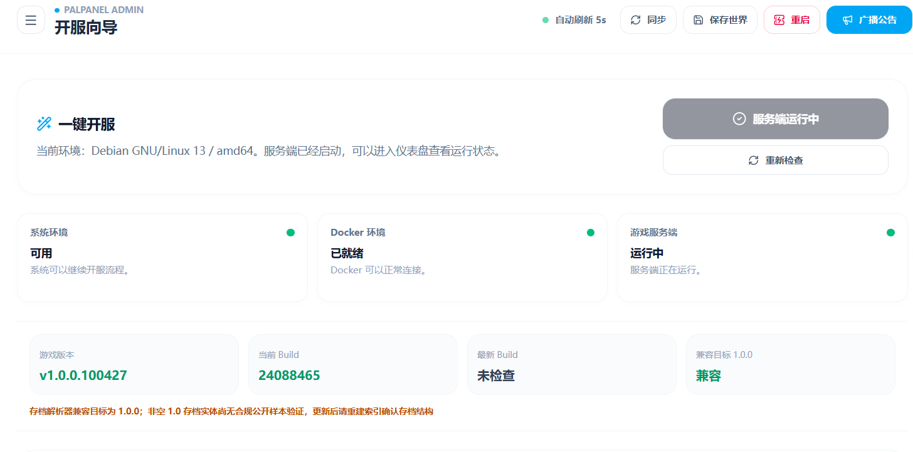
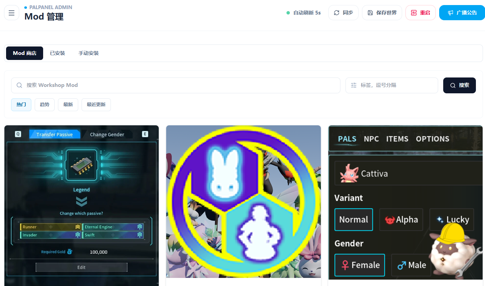
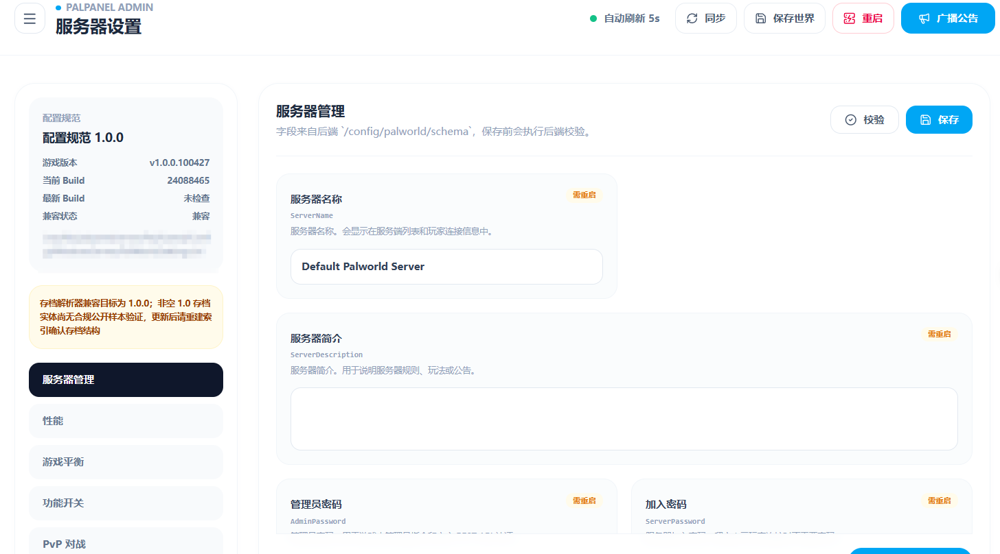
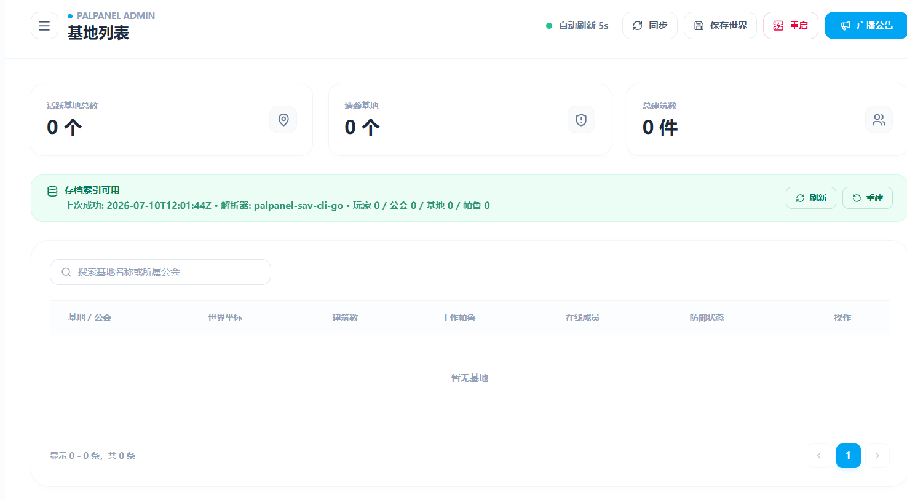

# PalPanel

PalPanel 是一个 Palworld Dedicated Server 管理面板。常用的开服、更新、备份、日志、Mod 和存档操作都可以在浏览器里完成。

当前版本是 `v1.0.3-hotfix.1`，提供 Linux amd64 和 Windows amd64 安装包。Windows 程序暂未签名，首次运行可能会触发 SmartScreen 提示。

## 功能

- 安装、启动、停止、重启和更新 Palworld 服务端
- 编辑启动参数和 `PalWorldSettings.ini`
- 查看在线人数、CPU、内存、FPS、端口和运行时间
- 管理日志、备份、世界存档和计划任务
- 查看玩家、公会、基地、帕鲁和容器数据
- 安装和更新 Mod
- 配置翻译服务
- 安装 PalDefender，并通过 `/gm` 管理玩家和物品
- 使用账号密码登录，也可创建单独的开发密钥

## 截图

<p align="center">
  
  
</p>

<p align="center">
  
  
</p>

## Linux 安装

```bash
curl -fsSL https://raw.githubusercontent.com/uitok/palworld-panel/main/install.sh | sudo bash
```

默认监听 `127.0.0.1:8080`。安装完成后打开脚本输出的地址，注册第一个管理员账号。

局域网访问：

```bash
curl -fsSL https://raw.githubusercontent.com/uitok/palworld-panel/main/install.sh | sudo bash -s -- --listen 0.0.0.0:8080
```

通过 SOCKS5 代理下载：

```bash
curl --proxy socks5h://127.0.0.1:10808 --noproxy '' -fsSL https://raw.githubusercontent.com/uitok/palworld-panel/main/install.sh | sudo bash -s -- --proxy socks5h://127.0.0.1:10808
```

需要 Wine Docker 模式时加 `--docker`。Docker 组权限接近 root，不需要 Docker 时不要开启。

## Windows 安装

从 [v1.0.3-hotfix.1 Release](https://github.com/uitok/palworld-panel/releases/tag/v1.0.3-hotfix.1) 下载 `palpanel_v1.0.3-hotfix.1_windows_amd64.zip`，校验 `SHA256SUMS` 后完整解压，再运行 `PalPanel.exe`。

Launcher 会启动后端和 `sav-cli`，健康检查通过后自动打开浏览器。不要直接在 ZIP 压缩包里运行程序。

## 便携运行

Linux 解压包可以不安装 systemd，直接在目录中运行：

```bash
./palpanelctl init
./palpanelctl start
./palpanelctl status
```

## 文件位置

| 内容 | 路径 |
| --- | --- |
| 当前程序 | `/opt/palpanel/current` |
| 版本目录 | `/opt/palpanel/<version>` |
| 面板配置 | `/etc/palpanel/palpanel.env` |
| 游戏、数据库、存档和备份 | `/var/lib/palpanel` |

升级不会覆盖 `/etc/palpanel` 和 `/var/lib/palpanel`。普通卸载也会保留这两个目录。

## 常用命令

```bash
# 状态
sudo /opt/palpanel/current/palpanelctl status

# 日志
sudo /opt/palpanel/current/palpanelctl logs -f

# 重启面板和 sav-cli
sudo /opt/palpanel/current/palpanelctl restart

# 卸载程序，保留配置和数据
sudo /opt/palpanel/current/palpanelctl uninstall

# 连配置和数据一起删除
sudo /opt/palpanel/current/palpanelctl uninstall --purge
```

安装 PalPanel 不会自动启动 Palworld。游戏服务端的安装和首次启动在开服向导中完成。

## 从源码运行

需要 Go `1.25.12`、Node.js 22 和 npm。Linux 正式包还需要 C/C++ 工具链。

```bash
# 后端
cd backend
go test -p=1 ./...

# 存档解析器
cd ../sav-cli
CGO_ENABLED=1 go test -p=1 ./...

# 前端
cd ../frontend
npm ci
npm run check
```

构建 Linux 包：

```bash
scripts/package.sh --version v1.0.3-hotfix.1 --targets linux-amd64 --clean
```

产物位于 `dist/packages/`。

## 说明

- 默认只监听本机；需要公网访问时请配置 HTTPS 反向代理和防火墙
- 配置文件按普通 `KEY=VALUE` 数据读取，不会作为 shell 脚本执行
- 密码、开发密钥和第三方 API Key 不要写入源码或问题截图
- Windows ZIP 未做 Authenticode 签名

## 相关项目

- [PST](https://github.com/zaigie/palworld-server-tool)：Palworld 服务器管理工具
- [DST 管理平台](https://github.com/miracleEverywhere/dst-management-platform-api)：《饥荒联机版》服务器管理项目

## 交流

<p align="center">
  
</p>

## 许可证

PalPanel 使用 GPL-3.0-or-later。第三方组件及素材的许可证见 [THIRD_PARTY_LICENSES.txt](THIRD_PARTY_LICENSES.txt)。
