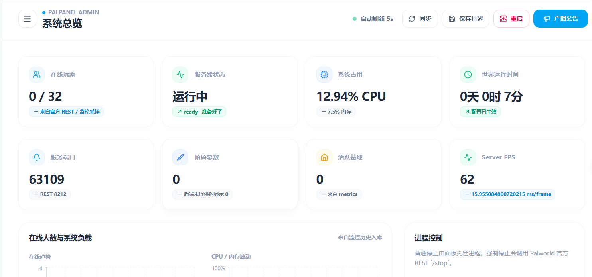

# PalPanel

PalPanel 是一个面向 Palworld Dedicated Server 的自托管管理面板。

开一台服并不难，麻烦的是后面的日常维护：更新、备份、看日志、改配置、处理 Mod，以及在出问题时弄清楚到底是哪一层没有正常工作。PalPanel 把这些操作放进一个中文 Web 界面里，同时保留可审计的任务记录和清晰的数据目录。

当前稳定版是 `v1.0.0`，正式发布目标为 Linux amd64。Windows Launcher 和原生 MinGW CI 已在仓库中，但暂不发布未签名的 Windows 安装包。



## 能做什么

- 安装、启动、停止、重启和更新 Palworld Dedicated Server。
- 管理启动参数与 `PalWorldSettings.ini`，保存前会做字段校验。
- 查看在线人数、CPU、内存、FPS、端口和世界运行时间。
- 实时查看 PalServer 日志，文件和 Docker 日志都会做大小限制与轮转。
- 创建、校验、下载和恢复备份；世界重置前会自动生成保护性备份。
- 解析存档中的玩家、公会、基地、帕鲁和容器信息，包括 PlM1/Oodle 存档。
- 搜索、安装、启停和更新 Workshop Mod，也支持手动上传 Mod 包。
- 配置 OpenAI-compatible 翻译服务，在面板内翻译 Workshop 描述。
- 使用管理员、操作员和只读 Token 分离权限，并记录写操作审计日志。

## 界面

<p align="center">
  
  
</p>

<p align="center">
  
  
</p>

## 快速开始

### Linux systemd 安装

准备一台 Linux amd64 主机。使用 Wine Docker 模式运行游戏时，需要先安装并启动 Docker。

从 [v1.0.0 Release](https://github.com/uitok/palworld-panel/releases/tag/v1.0.0) 下载 `palpanel_v1.0.0_linux_amd64.tar.gz`，然后执行：

```bash
tar -xzf palpanel_v1.0.0_linux_amd64.tar.gz
cd palpanel_v1.0.0_linux_amd64
sudo ./palpanelctl install --docker
```

`--docker` 会把独立的 `palpanel` 服务账号加入 Docker 组。Docker socket 基本等同于宿主机 root 权限，只应在确实使用 Wine Docker 模式时启用。

安装完成后获取管理员 Token：

```bash
sudo /opt/palpanel/current/palpanelctl token
```

面板默认监听 `127.0.0.1:8080`，不会直接暴露到局域网或公网。需要从其他机器访问时，编辑 `/etc/palpanel/palpanel.env`：

```ini
PALPANEL_LISTEN_ADDR=0.0.0.0:8080
```

然后重启面板：

```bash
sudo systemctl restart palpanel.service
```

公网环境建议仍然通过 HTTPS 反向代理访问，并只开放实际需要的面板和游戏端口。

### 便携模式

不安装 systemd 也可以直接在解压目录运行：

```bash
./palpanelctl init
./palpanelctl start
./palpanelctl status
```

便携模式把配置、数据、PID 和有界日志放在包内，适合试用或单用户环境。正式长期运行更推荐 systemd 安装。

## 文件放在哪里

systemd 模式使用三个互相独立的位置：

| 内容 | 路径 |
| --- | --- |
| 版本化程序 | `/opt/palpanel/<version>` |
| 当前版本链接 | `/opt/palpanel/current` |
| 配置与 Token | `/etc/palpanel/palpanel.env` |
| 游戏、存档、备份和数据库 | `/var/lib/palpanel` |
| systemd 服务 | `palpanel.service`、`palpanel-sav-cli.service` |

升级只切换程序版本，不会覆盖 `/etc/palpanel` 和 `/var/lib/palpanel`。普通卸载也会保留配置与数据，只有 `uninstall --purge` 会一并删除。

## 常用命令

```bash
# 服务状态
sudo /opt/palpanel/current/palpanelctl status

# 查看或持续跟踪日志
sudo /opt/palpanel/current/palpanelctl logs
sudo /opt/palpanel/current/palpanelctl logs -f

# 重启面板与 sav-cli
sudo /opt/palpanel/current/palpanelctl restart

# 再次读取管理员 Token
sudo /opt/palpanel/current/palpanelctl token

# 卸载程序但保留配置和数据
sudo /opt/palpanel/current/palpanelctl uninstall
```

安装面板不会自动启动 PalServer。游戏安装、首次启动和世界初始化由开服向导或面板中的服务器控制完成。

## Workshop 与 Steam

`STEAM_WEB_API_KEY` 只用于 Workshop 搜索和元数据读取，源码、前端和发布包都不包含默认 Key。未配置时，面板会明确显示 Workshop 搜索不可用，但不会影响手动安装或游戏本身启动。

需要注意，能搜索到 Mod 不代表 Steam 允许匿名下载其内容。是否支持 `steamcmd +login anonymous` 由具体游戏的 Workshop 分发策略决定；某些 Palworld Mod 需要拥有游戏的 Steam 账号，或者只能从作者提供的 GitHub/Nexus 发布页手动获取。

## 安全默认值

- 首次初始化生成随机的 64 个十六进制字符管理员 Token。
- 配置文件权限固定为 `0600`，进程环境变量优先于配置文件。
- `palpanel.env` 按数据解析，不会执行 shell、变量替换或命令替换。
- 默认启用鉴权并只监听本机回环地址。
- 前端生产构建使用同源 `/api`，不注入面板 Token。
- Steam Key、Authorization 和上游完整请求不会写入正常日志。

配置示例见 [scripts/palpanel.env.example](scripts/palpanel.env.example)。常用变量包括：

| 变量 | 用途 |
| --- | --- |
| `PANEL_TOKEN` | 管理员 Token |
| `PANEL_OPERATOR_TOKEN` | 可选的操作员 Token |
| `PANEL_VIEWER_TOKEN` | 可选的只读 Token |
| `PALPANEL_LISTEN_ADDR` | 面板监听地址，默认 `127.0.0.1:8080` |
| `PALPANEL_DATA_DIR` | 数据根目录 |
| `STEAM_WEB_API_KEY` | Workshop 搜索 Key |
| `PALPANEL_STEAM_API_TIMEOUT_SECONDS` | Steam API 超时，默认 15 秒 |
| `PALPANEL_AI_TRANSLATION_TIMEOUT_SECONDS` | AI 翻译超时，默认 90 秒 |
| `PALPANEL_LOG_LEVEL` | `debug`、`info`、`warn` 或 `error` |

## 项目结构

```text
frontend/   React + TypeScript 管理界面
backend/    Go API、SQLite、服务器与任务管理
sav-cli/    存档解析 sidecar
scripts/    打包、安装、冒烟和发布检查
```

浏览器只连接 Go 后端。后端负责鉴权、SQLite、Docker/Wine、Palworld REST 和 Steam API；sav-cli 作为独立 sidecar 解析存档，避免把原生 Oodle 解析器耦合进主进程。

## 从源码运行

需要 Go `1.25.12`、Node.js 22 和 npm。Linux 下构建 sav-cli 正式包还需要可用的 C/C++ 工具链。

```bash
# 后端
cd backend
go test ./...

# 存档解析器
cd ../sav-cli
CGO_ENABLED=1 go test ./...

# 前端
cd ../frontend
npm ci
npm run check

# Linux 正式包
cd ..
scripts/package.sh --version v1.0.0 --targets linux-amd64 --clean
```

产物会写入 `dist/packages/`，其中包括 Linux 包、sav-cli 对应源码、第三方许可清单和 SHA-256 校验文件。

## Windows 状态

仓库包含可双击运行的 `PalPanel.exe` Launcher，它负责初始化配置、启动后端与 sav-cli、等待健康检查并打开浏览器。Windows CI 使用原生 runner 和 MinGW CGO 做构建与进程清理测试。

目前没有 Authenticode 证书，因此 `v1.0.0` Release 不上传未签名的 EXE 或 ZIP。源码和 CI 可以继续演进，正式 Windows 资产会在签名链路准备好后发布。

## 许可证

`sav-cli` 及其 vendored gooz 源码按 GPL-3.0-or-later 分发，对应源码包随 Release 提供。后端和前端维持仓库现有的许可状态，完整第三方清单见 [THIRD_PARTY_LICENSES.txt](THIRD_PARTY_LICENSES.txt)。
