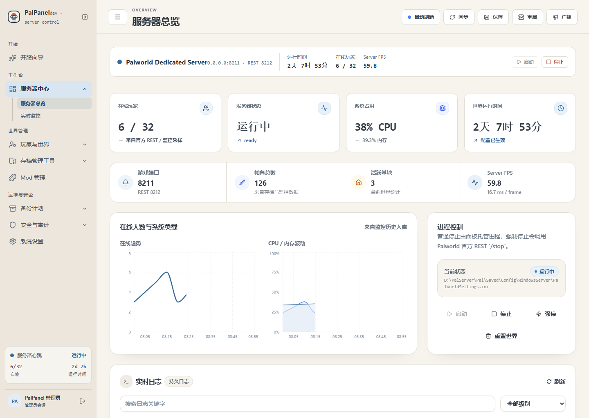
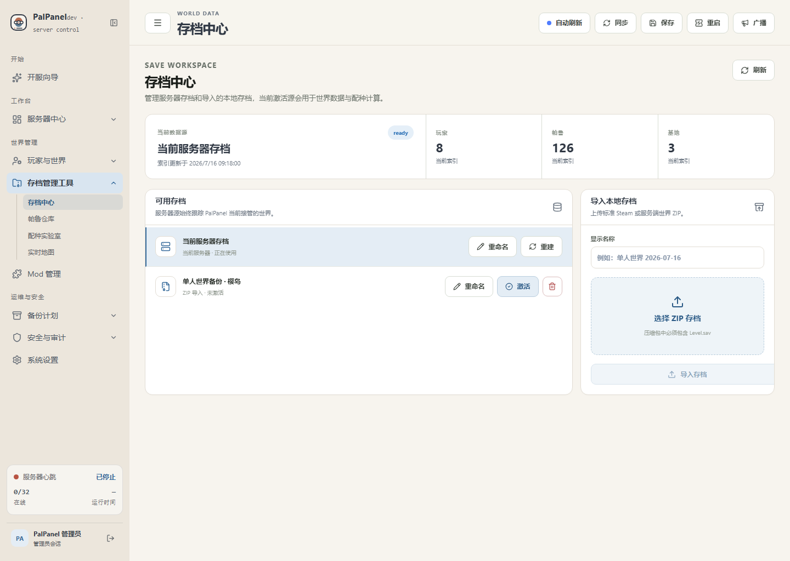
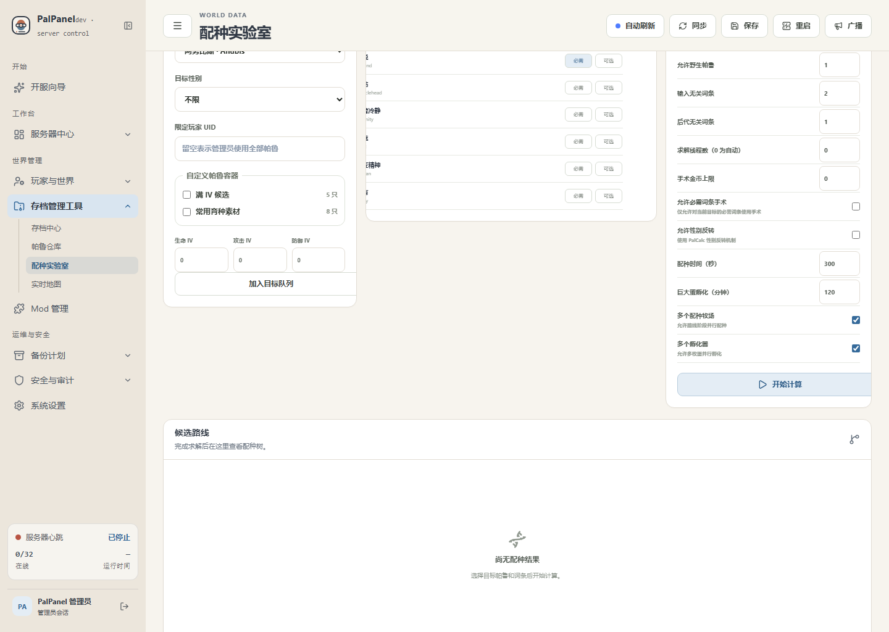
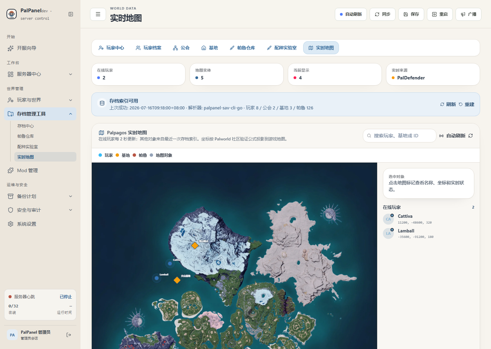
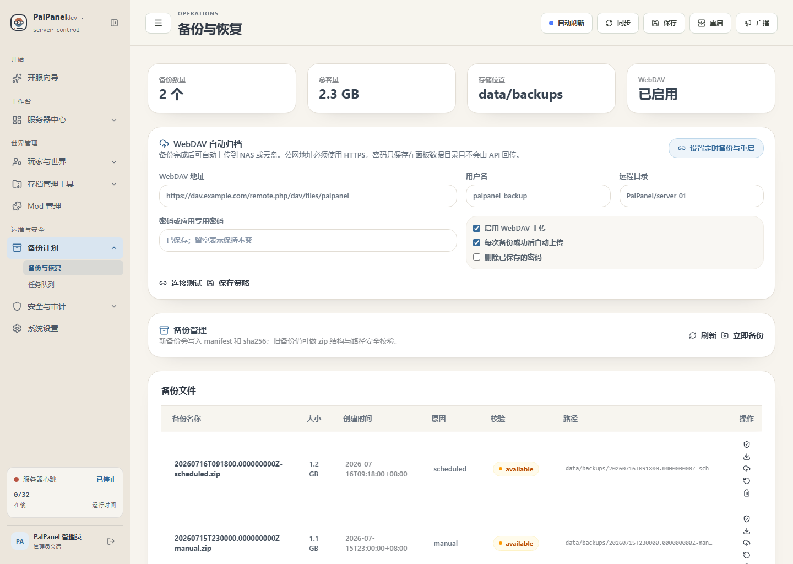
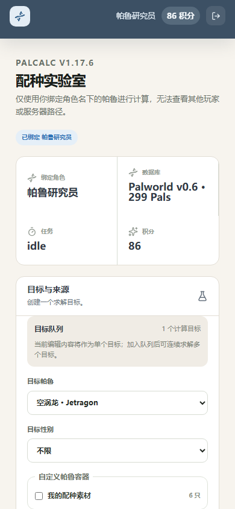

# PalPanel

<p align="center">
  
</p>

PalPanel 是给《幻兽帕鲁》专用服务器用的自托管面板。后端用 Go，前端用 React，存档解析由 `sav-cli` 处理，配种计算通过独立的 `palcalc-bridge` 运行。

项目现在可以完成开服、启停、更新、监控、备份、Mod 管理和存档查询；当前版本也已经加入多存档、PalCalc 配种、AstrBot QQ 插件、WebDAV 归档和新的客户端界面。

<p align="center">
  <a href="https://github.com/uitok/palworld-panel/releases"></a>
  <a href="LICENSE"></a>
  
  
</p>

## 界面



<p align="center">
  
  
</p>

<p align="center">
  
  
</p>

<p align="center">
  
</p>

## 已经能做什么

### 服务器维护

- 在 Windows 上通过 SteamCMD 安装或接管现有 `PalServer.exe`
- 在 Linux 上使用 Docker + Wine 管理服务端
- 启动、停止、保存世界、安全重启、检查更新和查看日志
- 查看 CPU、内存、磁盘、在线人数、Server FPS 和运行时间
- 编辑启动参数与 `PalWorldSettings.ini`
- 管理 Workshop、Pak、LogicMods、UE4SS 和 PalDefender
- 配置每日或按间隔执行的安全重启与自动备份
- 创建、校验、下载和恢复备份，并在备份完成后上传到 WebDAV

### 存档与地图

- 把当前服务器世界作为内置存档源
- 导入带有 `Level.sav` 的标准 ZIP 存档
- 切换、重命名、重建和删除导入的数据源
- 查询玩家、公会、基地、容器和帕鲁
- 读取帕鲁的性别、IV、星级、技能、被动词条、主人和所在容器
- 在 Palpagos 游戏地图上显示玩家、基地和存档实体

ZIP 导入会检查路径穿越、软链接、文件数量和解压大小。当前支持 Steam 与 Palworld Dedicated Server 存档，不支持 Xbox WGS。

### 配种实验室

项目固定使用 [PalCalc v1.17.6](https://github.com/tylercamp/palcalc/tree/v1.17.6)，上游提交为 `8b7e2f779e47fddae16ddcb973e828ba20c02b80`。

- 设置目标帕鲁、性别、必需/可选被动与 IV 下限
- 从玩家、容器、自定义帕鲁或允许的野生帕鲁中选材料
- 调整最大步数、迭代数、线程数、无关词条和手术词条等参数
- 排队、暂停、继续或取消计算任务
- 查看候选路线、概率、蛋数、预计时间和完整配种树
- 存档变化后保留旧结果，同时标记可能过期的路线

PalCalc 通过 .NET 9 侧车运行。侧车不可用时只会关闭配种功能，不影响服务器管理和存档浏览。

### AstrBot QQ 插件

插件在 [`astrbot_plugin_palpanel`](astrbot_plugin_palpanel)，目标环境为 AstrBot `>=4.18,<5`、NapCat/OneBot v11（`aiocqhttp`）。已经实现的命令包括：

| 命令 | 用途 |
| --- | --- |
| `/bd <游戏昵称>` | 请求游戏内绑定验证码 |
| `/bdqr <验证码>` | 确认 QQ 与 PlayerUID 的绑定 |
| `/qd` | 每日签到 |
| `/jf` | 查看积分与近期流水 |
| `/pz` | 生成一次性面板链接 |
| `/pz <目标帕鲁> [被动词条...]` | 提交快捷配种计算 |
| `/paladmin ...` | 人工绑定、解绑、冻结和积分调整 |

默认签到奖励 10 分，成功计算消耗 1 分。计算失败、取消或超时会退回预留积分。验证码只保存哈希，5 分钟后失效，并要求玩家在线且 PalDefender 能发送私聊消息。

插件的存储、积分并发约束和 HMAC 签名单元测试已经通过；NapCat、真实 QQ 群与在线玩家的完整联调仍需要部署者自己的机器人和群环境。

## 实机验证

2026-07-17 在 Windows 测试服上使用 Palworld Dedicated Server Build `24181105` 做过以下检查：

- 面板识别并启动现有服务端
- 官方 REST/GameData 端口正常就绪
- 保存世界后 `Level.sav` 实际更新时间发生变化
- 在线创建备份并通过 manifest/hash 校验
- 使用 Windows CGO 版 `sav-cli` 解析真实 `Level.sav`
- 安全重启完成，重启前后的 PalServer PID 不同，REST 随后恢复
- 临时开发 Token 可访问受保护接口，撤销后立即返回 401

测试世界里没有玩家角色，所以这次实机索引的玩家、帕鲁和公会数量为 0；非空存档解析继续由固定样本和自动化测试覆盖。

## 安装

### Windows amd64

1. 从 [Releases](https://github.com/uitok/palworld-panel/releases) 下载 Windows ZIP 和 `SHA256SUMS`。
2. 校验后解压到固定的可写目录，例如 `D:\PalPanel`。
3. 运行 `PalPanel.exe`，在浏览器中注册第一个管理员。
4. 在开服向导中安装服务端，或接管已有的 `PalServer.exe` 目录。

不要直接在 ZIP 里运行程序。当前 Windows 包没有 Authenticode 签名，SmartScreen 可能显示“未知发布者”。

### Linux amd64

安装最新正式版：

```bash
curl -fsSL https://raw.githubusercontent.com/uitok/palworld-panel/main/install.sh | sudo bash
```

默认只监听 `127.0.0.1:8080`。需要从局域网访问时，可以在安装时指定地址：

```bash
curl -fsSL https://raw.githubusercontent.com/uitok/palworld-panel/main/install.sh | sudo bash -s -- --listen 0.0.0.0:8080
```

常用命令：

```bash
sudo /opt/palpanel/current/palpanelctl status
sudo /opt/palpanel/current/palpanelctl logs -f
sudo /opt/palpanel/current/palpanelctl restart
sudo /opt/palpanel/current/palpanelctl uninstall
```

请不要把没有 HTTPS 和访问控制的面板直接暴露到公网。

## AstrBot 配置

把 `astrbot_plugin_palpanel` 作为本地插件安装，在 AstrBot WebUI 中填写配置。字段定义见 [`_conf_schema.json`](astrbot_plugin_palpanel/_conf_schema.json)。

| AstrBot 配置 | PalPanel 配置 | 说明 |
| --- | --- | --- |
| `panel_url` | PalPanel 地址 | 同机通常使用 `http://127.0.0.1:8080` |
| `panel_public_url` | — | QQ 用户打开一次性链接时使用的地址 |
| `panel_id` | `PALPANEL_ASTRBOT_PANEL_ID` | 两边必须一致 |
| `shared_secret` | `PALPANEL_ASTRBOT_SHARED_SECRET` | 两边使用同一条随机密钥 |
| `listen_host:listen_port` | `PALPANEL_ASTRBOT_PLUGIN_URL` | 默认 `127.0.0.1:8092` |
| `allowed_group_id` | — | 允许使用命令的 QQ 群 |

双方请求使用 HMAC-SHA256，并校验时间戳和随机数。跨主机部署时应使用 HTTPS。

## 从源码运行

需要 Go `1.25.12`、Node.js 22、npm 和 .NET 9 SDK。Windows 构建 `sav-cli` 还需要 MinGW-w64。

```bash
git clone --recurse-submodules https://github.com/uitok/palworld-panel.git
cd palworld-panel
```

主要目录：

```text
backend/                    Go API、任务和数据服务
frontend/                   React 管理界面与 QQ 受限页面
sav-cli/                    Palworld 存档解析侧车
palcalc-bridge/             PalCalc .NET 9 求解侧车
third_party/palcalc/        固定版本的 PalCalc 子模块
astrbot_plugin_palpanel/    AstrBot QQ 插件
scripts/                    安装、打包和维护脚本
docs/                       OpenAPI、发布说明和截图
```

本地检查：

```bash
(cd backend && go test -p=1 ./...)
(cd sav-cli && CGO_ENABLED=1 go test -p=1 ./...)
(cd palcalc-bridge && dotnet build -c Release)
(cd frontend && npm ci && npm run check && npm run test:e2e)
python -m unittest discover -s astrbot_plugin_palpanel/tests
```

接口定义在 [`docs/openapi.yaml`](docs/openapi.yaml)。`dev` 分支每次推送后会生成 Windows/Linux 开发包，正式版本以 [Releases](https://github.com/uitok/palworld-panel/releases) 为准。

## 安全与限制

- 管理员会话和 QQ 配种会话使用不同的 Cookie 与权限检查
- QQ 用户不能读取其他玩家、原始存档路径或管理接口
- WebDAV 密码、开发 Token、HMAC 密钥和游戏管理员密码不会写入日志
- 公网 WebDAV 地址必须使用 HTTPS；回环与私有网络地址可以使用 HTTP
- 当前不支持 Xbox WGS、多 PalPanel 租户和 QQ 用户自行上传个人存档

## 交流

<p align="center">
  
</p>

提交问题时请附上 PalPanel 版本、操作系统、运行方式和复现步骤，并先删掉日志中的密码、Token、API Key 与公网地址。

## 许可证

PalPanel 使用 [GPL-3.0-or-later](LICENSE)。PalCalc v1.17.6 保留 MIT 许可证；其余第三方组件与地图素材见 [`THIRD_PARTY_LICENSES.txt`](THIRD_PARTY_LICENSES.txt)。
